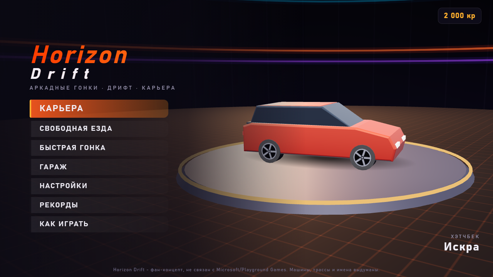
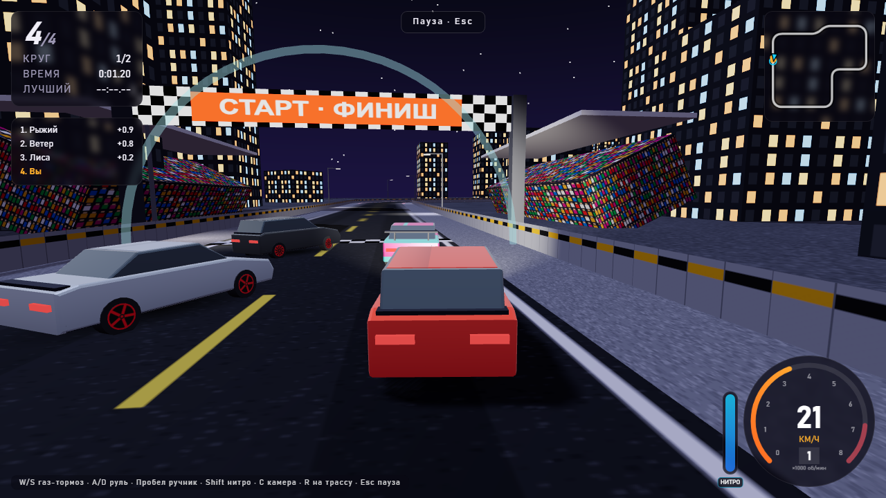
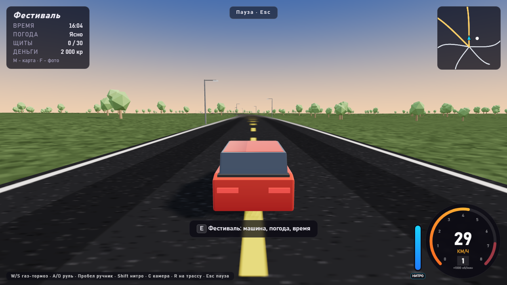

# Horizon Drift

**English** · [Русский](README.ru.md)

**Horizon Drift** is an arcade racing and drifting game in 3D, in a single HTML page. It runs in
the browser with no server and no internet: open `index.html` or play it online.

**[▶ Play online](https://alexalesha.github.io/HorizonDrift/)**

> Fan-made game. Not affiliated with or endorsed by Microsoft or Playground Games. All cars,
> tracks, drivers and names are made up. Models, textures, sound and music are made by code in
> the game itself.

The interface is in Russian.







## What is in the game

- **Career:** 5 cups of 3-4 events; medals open the next cup, prize money buys cars and tuning
  in the Garage (engine, tyres, suspension, weight, nitro, paint and rims).
- **Modes:** race, drift (points for angle and long chains, multiplier up to ×5), time trial,
  duel with the cup champion, elimination.
- **8 cars and 8 tracks** on asphalt, gravel, snow, grass and sand; the surface changes grip.
- **Free roam on 4 big maps** (Coast, Mountains, Desert, Megacity) streamed around the car:
  roads with bridges and tunnels, a festival hub, events on the map, fast travel, day and night,
  weather, a map (M) and a photo mode (F).
- Cameras: chase, far, hood and a cockpit with dashboard and gauges.
- Physics with a friction circle, traction control, ABS and steering assist (all switchable);
  AI rivals; synthesised engine sound and music; records and settings are saved.

## Controls

| Key | Action |
|---|---|
| W / ↑ | throttle |
| S / ↓ | brake and reverse |
| A D / ← → | steer |
| Space | handbrake: kick the rear out into a drift |
| Shift | nitro (fills up while drifting) |
| E / Q | gear up / down (manual gearbox) |
| C | camera |
| V | look back |
| R | back on the track |
| P or Esc | pause |
| M / F / E | map / photo mode / interact (free roam) |

Keys can be changed in Settings. Gamepad: stick to steer, triggers for throttle and brake.

## Run locally

Open `index.html` in Chrome, Edge or Firefox. three.js r149 is in `vendor/` (MIT, see
`vendor/three.LICENSE.txt`), so nothing is downloaded.

## Tests

The laws of the game are Playwright tests in `tests/`: physics, career, the open world (road
connectivity, streaming at 300 km/h, memory over 10 minutes of driving), solid geometry, the
camera. They open the page by its file address in headless Chromium, one at a time:

```
npm install
npx playwright install chromium
npm test
```

Mouse capture in the tests is always a stub (a real `requestPointerLock` in headless Chromium on
Windows can clip the user's cursor). `npm run screenshots` makes the pictures above.

## History

The game was made in the MixOfProject collection (folder `web/horizon_drift_offline`), where it
also runs inside the Igroteka desktop app. This repository carries the game with its full commit
history.

## Licence

MIT, see [LICENSE](LICENSE). three.js: MIT.
